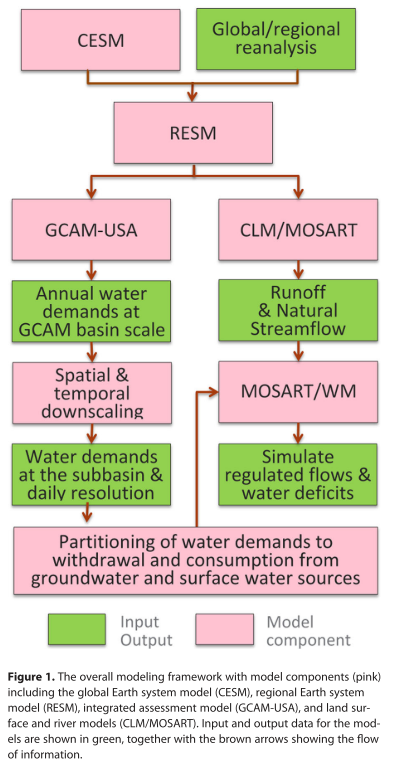
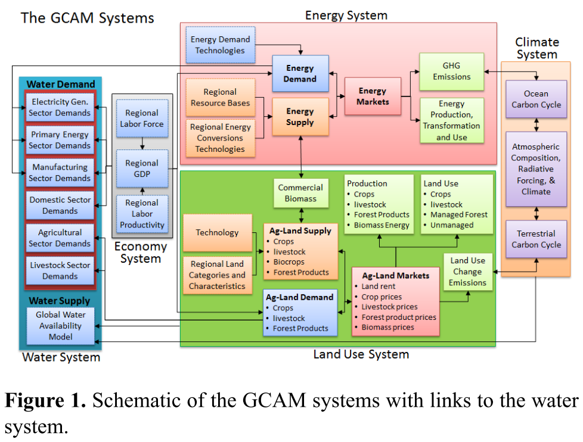
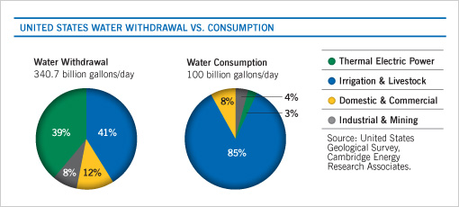
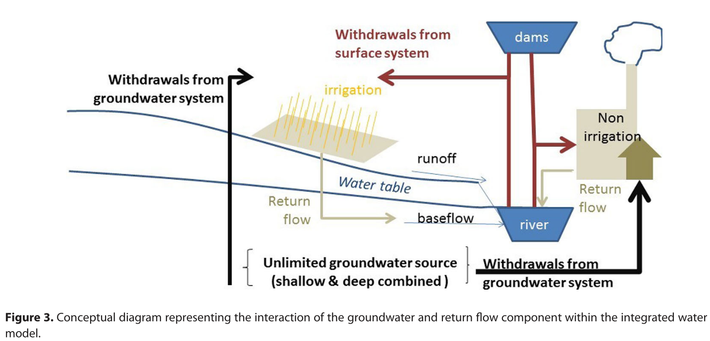

# Representation of Water Demand

人类活动与地球系统之间的联系应该被量化反映到模拟地球系统过程的模型中以了解人类活动的影响，这也是Earth system modeling中的重要挑战。人类活动关键要素之一就是 水资源管理，其中，一个重要的环节就是water demand的分析。这里就简单记录下review的water demand，尤其是针对水库的需水的建模方法。

## On inclusion of water resource management in Earth system models – Part 1: Problem definition and representation of water demand （2015）

这是一篇综述性质的文章，总结了在LSM（land surface model）和GHM（global hydrological model）等大尺度模型中的各类型water demand算法的文献，讨论了他们的优缺点，强调了不确定性以及它们的局限。下面就稍微阐述下。

首先简单明确一些概念：

- GHM更多地关注于water cycle，而LSM也关注其他陆面过程，比如energy and carbon cycles。不论是LSM还是GHM，在模拟预测水文变量方面都有待进一步改善。
- 工业时代之后，人类进入新的地质期：“Anthropocene”，即人类世。陆面系统的自然过程，比如水循环，已深刻被人类活动影响，因此地球系统中也应该包括人类活动，对水循环,即需要 human-water interactions，这也是目前的模型中缺少的
- 人类活动对水循环的影响也有不同方面，比如land use变化，比如水资源管理。水资源方面，随着人口增加，工业发展等，人类用水量过去一个世纪有着显著的增加，这样大量需水对水循环会造成显著影响。
- 比如dam operations会改变自然径流的timing，volume，peak以及age。

然后，这篇文章的主要目的是：考虑围绕人类活动对陆面水循环影响的科学以及数据上的挑战，目前实践的情况以及未来研究的方向，主要关注在水资源管理方面，关注水量，不同人类需求的水资源的存储，抽取和再分配。目前Large scale model中Water resources management 模块还存在一些基本问题。首先，是 the conservation of water，在human-water耦合系统中capture water，但这建模很复杂；其次影响因素多，如何考虑是问题；第三，企业晒reginal 和 global的用水和水资源系统调度数据，比如gao huilin等人的文章中说：“there are no direct observations of reservoir storage”；第四， local水资源调度模型和large-scale的应用与研究是有gap的，局部的研究有更充分的数据，而大尺度的分析是较难用local上的方法的。为了评估水资源管理的影响，需要先用算法来描述需水并将其包含到大尺度模型中。这篇文章具体来说，就是调研 the representation of water demand。

论文将需水分为两类，irrigatve和non-irrigative。讨论了不同的计算算法。算法通常的做法是降尺度（top-down 方法）或直接在grid尺度建模（bottom-up方法）。根据应用的类型，这些算法可以被包含在不同的大尺度模型中。另外，需水的计算融入到模型中有online和offline两类不同模式。offline是不需要需水和自然过程之间的互相影响的，不考虑互馈；online是考虑的。GHM中一般是offline的，因为不考虑energy balance等过程。以下是论文的各部分主要内容。

第一，human demand的类型即其对water cycle的影响。灌溉用水还是占比较大，减少了streamflow volume和地下水位，扰动了自然条件；另外影响土壤含水量，会影响陆面过程。非灌溉用水相对少，但有显著的空间变化性（人口，经济水平等），不过非灌溉用水更多地不是consumptive water use，纯消耗的只占一小部分，更多地是return flow。，对径流的扰动更多地是timing。

第二，irrigative demand in large-scale models 的 available representation。灌溉比非灌溉的demand探索得更深。为简化描述，作者对灌溉需水的表示进行了分类：尺度(区域vs全球)；和/或模拟模式(离线与在线)。原文表1(区域)和表2(全球)总结离线模拟的典型例子。表3提供一些online的例子。离线更多，在线的模拟范围都先对较小。这里把表内容copy过来了。

Table 1. Representative examples including **regional irrigation** in large-scale models (**offline mode**)

|Reference |Irrigation data |Irrigation demand |Region |Host model |Forcing |Temporal resolution| Spatial resolution|
|-|-|-|-|-|-|-|-|
|Haddeland et al. (2006)|Döll and Siebert (2002)| Difference between current soil  moisture content and minimum of FAO Penman–Monteith crop-specific evapotranspiration and soil moisture content at field capacity.|Colorado (USA) and Mekong (east Asia)|VIC (Liang et al., 1994) |Adam and Lettenmaier (2003); Maurer et al. (2002)|3 h |0.5° * 0.5°|
|Haddeland et al. (2007)|Siebert et al. (2005)|Haddeland et al. (2006)| North  America and Asia|VIC (Liang et al., 1994) |Maurer et al. (2002)|24 h| 0.5° * 0.5°|
|Gueneau et al. (2012)|GAEZ (IIASA/FAO, 2012);FRIS (USDA, 2008)|Difference between actual and potential evapotranspiration based on Farmer et al. (2011). Crop growth and irrigation losses included.|USA| CLM3.5 (Oleson et al., 2004, 2008)| NCC (Ngo-Duc et al., 2005b)| 6 h |2.5° *2.5°|
|Leng et al. (2013)|MODIS (Ozdogan and Gutman, 2008);NASS (USDA, 2002)|Difference between current and ideal soil moisture content based on CLM4CNcrop crop growth model of CLM4 (Levis and Sacks, 2011; Levis et al., 2012).|Conterminous USA |CLM4 (Lawrence et al., 2011)|NLDAS (Cosgrove et al., 2003)|1 h |0.125° *0.125°|
|Nakayama and Shankman (2013)|Liu et al. (2010)| Difference between current soil moisture content and soil moisture at the field capacity.|Changjing, Yellow River basins (China)| NICE (Nakayama, 2011)|ECMWF (http://www.ecmwf.int/en/forecasts/datasets)| 6 h |10 km*10 km|
|Voisin et al. (2013)|Crop area projections in Chaturvedi et al. (2013a, b).|Downscaling GCAM model estimations (Wise and Calvin, 2011;Wise et al., 2009a) using methods of Hejazi et al. (2013a), Siebert and Döll (2008) and Hanasaki et al. (2013a, b).| US Mid-west |SCLM-MOSART(Lawrence et al.,2011; Li et al.,2013); Tesfa et al. (2014)| CASCaDE(http://cascade.wr.usgs.gov)| 1 h |0.125° *0.125°|

Table 2. Representative examples including **global irrigation** in large-scale models (**offline mode**).

|Reference |Irrigation data |Irrigation demand |Host model |Forcing |Temporal resolution| Spatial resolution|
|-|-|-|-|-|-|-|
|Döll and Siebert (2002) |Döll and Siebert (2000)|Difference between Smith (1992) effective rainfall and Priestley and Taylor (1972) crop-specific potential evapotranspiration and Allen et al. (1998) multipliers.|WaterGAP(Alcamo et al.,2003)| CRU TS 1.0 (New et al., 1999, 2000)| 24 h| 0.5° *0.5°|
|de Rosnay et al. (2003)*| Döll and Siebert (2002)| Difference between effective rainfall and FAO potential evapotranspiration (Allen et al., 1998) without considering irrigation efficiency.| ORCHIDEE(Ducoudré et al., 1993)| ISLSCP-I (Sellers et al., 1996b)|24 h| 1° *1°|
|Hanasaki et al. (2006) | Döll and Siebert(2000)| Similar to Döll and Siebert (2002). Reference evaporation is based on FAO Penman–Monteith.|TRIP (Oki and Sud, 1998)|ISLSCP-I (Sellers et al., 1996b)|24 h |0.5° *0.5°|
|Wisser et al. (2008)| Siebert et al. (2005, 2007);GIAM (Thenkabail et al., 2009) |Similar to Haddeland et al. (2006) using Allen et al. (1998) procedure.| WBM(Vörösmarty et al., 1998)| CRU TS 2.1 (Mitchell and Jones,2005);NCEP (Kalnay et al.,1996)|24 h |0.5° *0.5°|
|Rost et al. (2008, 2009)|Siebert et al. (2007)| Difference between available plant moisture and an updated Priestley and Taylor (1972) potential evaporation based on potential canopy conductance of carbon and water (Sitch et al., 2003).|LPJmL (Bondeau et al., 2007)|CRU TS 2.1(Mitchell and Jones,2005)| 24 h| 0.5° *0.5°|
|Hanasaki et al. (2008a, b) |Döll and Siebert (2000)|Difference between current and 75% of field capacity. Irrigation applied 30 days prior to planting. Detailed crop growth representation based on SWIM (Krysanova et al.,1998). | H08 (Hanasaki  et al., 2008a, b)|NCEP-DOE (Kanamitsu et al.,2002); GSWP-2(Zhao and Dirmeyer,2003)|24 h |1° *1°|
|Siebert and Döll (2010)|MIRCA2000 (Portmann et al.,2010)|Difference between actual and crop-dependent reference evapotranspiration computed according to Priestley and Taylor  (1972). Crop coefficients obtained from Allen et al. (1998).| GCWM (Siebert and Döll, 2008)|CRU TS 2.1 (Mitchell and Jones, 2005)| 24 h |0.08° *0.08°|
|Wada et al.(2011, 2012)| MIRCA2000 (Portmann et al.,2010)|Difference between actual and potential transpiration according to van Beek et al. (2011), using Priestley and Taylor (1972) for calculating crop-specific and transpiration (Allen et al., 1998). |PCR- GLOBWB (van Beek et al., 2011)|CRU TS 1.0 (New et  al., 1999, 2000)|24 h |0.5° *0.5°|
|Pokhrel et al. (2012)|Siebert et al. (2007) |Procedure of Hanasaki et al. (2008a, b). Crop calendar is based on potential evapotranspiration (Allen et al., 1998). | MASTIRO (Takata et al.,2003)|Kim et al. (2009); GPCC (Rudolf et al., 2005)|6 h| 1° *1°|
|Wada et al.(2014)| MIRCA2000 (Portmann et al.,2010)|Constant 50mm surface-water depth for paddy irrigation until 20 days before harvesting. For non-paddy areas, the difference between current and ideal plant available moisture at field capacity with dynamic root zone.|PCR-GLOBWB (van Beek et al., 2011)|ERA-Interim (Dee et al., 2011); MERRA (http://gmao.gsfc.nasa.gov/merra/)|24 h |0.5° *0.5°|

Table 3. Representative examples including irrigation in coupled land-surface models (**online mode**).

|Reference| Irrigation data |Irrigation demand| Region |Host LSM |Climate model|Temporal resolution| Spatial resolution|
|-|-|-|-|-|-|-|-|
|Adegoke et al. (2003)|LandSat(http://landsat.gsfc.nasa.gov/)| Target soil moisture deficit (difference between actual and saturated soil moisture).|High Plains (USA)| LEAF-2 (Walko et al., 2000)| RAMS (Pielke et al., 1992)|30 s nested in 1 min|10 km*10 km nested in 40 km*40 km|
|Sacks et al.(2009)| FAO-AQUASTAT(http://www.fao.org/nr/water/aquastat/main/index.stm)| AQUASTAT irrigated water uses applied at constant rate when LAI exceeds 80% of the maximum annual value. |Global| CLM3.5 (Oleson et al., 2008)|CAM (Collins et al., 2004, 2006)| 20 min| 2.8° *2.8°|
|Sorooshian etal. (2011) | CIMIS-MODIS(http://wwwcimis.water.ca.gov/) | Target soil moisture deficit (irrigation starts when the soil moisture drops below a maximum depletion threshold beyond which the plant in stressed (a percentage of field capacity, depending on the crop) and continues to field capacity)| California Central Valley (USA)|Noah (Ek et al., 2003) | NCAR-MM5(Chen and  Dudhia, 2001a, b)|30 min 1 h |4 km*4 km  12 km*12 km  36 km*36 km|
|Harding and Snyder (2012a, b)|MODIS (Friedl et al., 2002; Ozdogan and Gutman, 2008); NASS (USDA, 2002)| Target soil moisture deficit (difference between actual and saturated soil moisture to depth of 2 m). |Great Plains (USA)| Noah (Ek et al., 2003)|WRF (Skamarock et al., 2005)| 30 and 25 s |10 km*10 km|
|Guimberteau et al. (2012)|Döll and Siebert (2002) |Difference between potential transpiration and the net water amount kept by the soil (i.e., the difference between precipitation reaching the soil and total runoff).| Global| ORCHIDEE (Ducoudré et al., 1993)|LMDZ4(Hourdin et al., 2006)| 30 min |2.5° *1.25°|
|Qian et al. (2013)|MODIS (Ozdogan and Gutman, 2008; Ozdogan et al., 2010) |Similar to Sorooshian et al. (2011). Based on Ozdogan et al. (2010), moisture threshold is fixed at 50% of filed capacity. Roots grow based on| Southern Great Plains (USA)| Noah (Ek et al., 2003)| WRF (Skamarock et al., 2005)|3 h |12 km*12 km|

第三，non-irrigative demand 的 available representation。

以上两部分是这篇文章的最重要内容。接下来，第四，介绍了上面的表达在large-scale models中的应用。

最后是讨论以及对未来的展望。

## Effects of spatially distributed sectoral water management on the redistribution of water resources in an integrated water model （2017）

先了解下摘要，记住一些基本名词。sectoral water withdrawals，consumptive demands 和 给surface以及地下水资源的分配 的表示对提升水循环整体建模是重要的。这篇文章加强了水资源管理在**区域地球系统earth system（ES）**的表达，基本内容是用一个针对地表地下水的**区域 integrated assessment（IA）模型**模拟 sectoral water demands ，然后将**sectoral water demands** 进行空间分布式分配。通过分析CONUS主要**水文区域里模拟的regulated flow 和 sectoral supply deficit** 来评价这个 **integrated modeling framework（IA-ES）**，这点和地球系统关注water storage 变化有区别的。**historical supply deficit 的减少**被作为评价IA-ES模型 在表示评估未来adaption和mitigation strategies的复杂sectoral 人类活动方面的improvement的 指标。这篇文章还评估了由地下水和return flow modules的**individual 和 combined addtions** 导致的 灌溉和非灌溉sectors的**regulated flow和unmet demands的空间变化**。结果表明 通过减少water supply deficit，地下水有显著的regional和sectoral 效果。水文模式上，sectoral return flow 展示了清晰的水文模式上的东西对比，因此return flow 和 IA sectoral demands 一起成为一个美国重要的水资源和water deficits的空间分布因素。这篇文章的分析点出了在获取水资源以及deficits的跨流域分配的区域差异方面，对水资源管理的空间分布secroal表示的需要。

接下来不完全按照原文顺序解读，先结合 introduction 和 modeling framework 把文章的基本方法了解下。

### 论文方法框架

首先，如前面所示，在分析人类活动-地球系统交互的方面，现在有两类策略，一是 integrated assessment（IA）community，他们把water 包含到其建模框架中；另一类是Earth System（ES）modeling community，他们将人类活动，比如水库调度，灌溉模式，地下水抽取等加入到land surface model中。耦合IA和ES这两种模型以充分利用两类模型各自对人类活动和自然物理过程的丰富表达的实验还不多。这里展示文章methodology部分的主图：

上面图的左半部分（从GCAM-USA到Partitioning of ... water resources）可以认为就是IA，剩下的就是ES了。ES中包括了反应自然物理过程的降雨径流汇流过程，以及一个反映调度等的水资源管理模块。

#### GCAM water demand

IA 简而言之，就是一种分析人类活动的模型框架，这里主要用来分析 不同 water demand，更具体地就是指原文2.1节的 regional integrated assessment model。区域IA 能用来提供网格化的water demands 估计。这里具体用到的就是 GCAM-USA 模型，即 [GCAM](https://github.com/JGCRI/gcam-core) 这个模型中加入更多美国的区域特点后的版本。根据它，可以计算6类需水组成：irrigation requirements（at ten agroecological units），domestic，manufacturing，electricity generation（at the State level），livestock 以及 primary energy（at natioanl scale），可以跟踪多个空间尺度和年时间尺度的变化。

首先，简单补充下GCAM的基本概念，GCAM（Global Change Assessment Model） 是一个整合对经济，能源，农业，气候，土地等多对象表示的一反映全球动态变化的模型，输入中还包括了人口，劳动生产率，能源、农业技术特点，资源可利用性等。其基本架构及各部分和水系统的联系可参考下图：

在现在的GCAM中，水没有货币价值，当用水需求不能满足时，多余的供应假设来自地下水。

由于GCAM生成的结果和后面的ES模型的时空尺度都不匹配，所以为了耦合，需要对GCAM结果进行空间时间上的降尺度，简而言之，是做了一个时间和空间上的分解，具体的做法可以参考：[One-way coupling of an integrated assessment model and a water resources model: evaluation and implications of future changes over the US Midwest](https://doi.org/10.5194/hess-17-4555-2013)。空间降尺度方面，主要是要利用了人口，灌溉面积等信息将water demands 分解到小尺度，更详细的过程需要参考文献[Integrated assessment of global water scarcity over the 21st century under multiple climate change mitigation policies](https://doi.org/10.5194/hess-18-2859-2014)的4.2节。然后再在state尺度上和USGS的统计结果比较，根据相关系数来大致判断结果的合理性；时间方面，需要从5年一个值的尺度降到天尺度，首先线性插值5年的数据到一年；然后针对不同的用水类型，按照不同的方式降到月尺度；最后在月尺度上使用均匀分布降到日尺度。

下面稍微展开了解下如何从月尺度降到天尺度。针对6种需水，这里分为了4类分别计算。

第一是灌溉irrigation，使用一个叫做 monthly profile 的东西来帮助将年数据降尺度到月上。 monthly profile就是一个轨迹线，有了它，年数据就可以根据它按比例分配到各个月。monthly profile 是通过Global Crop Water Demand Model（GCWM）来获得的，GCWM提供了全球网格的26种作物的月灌溉需水。这26种作物得和GCAM的12类作物之间建立起一个映射关系来帮助估计作物区域月灌溉分布。这样就能为美国每个AEZ（agro-ecological zone）区域构建monthly profiles。然后根据monthly profile 就可以将年灌溉数据降尺度到月尺度。
$$W_{ij}=W_j * Ratio_{AEZ_{ij}}$$
其中，$W_{ij}$是第j年第i月的灌溉需水。

第二类是电力用水。假定用水和发电是正比的。GCAM中用电有三部分：industry，transportation，和 building。工业用水和交通用水被假定为年内是均匀分布的。所以主要变化来自建筑内电力用水。这部分是认为有季节性波动的，计算基于热天和冷天的概念 -- heating degree days（HDD） 和 cooling degree days（CDD）。具体计算这里暂不赘述了，可以查看原文。

第三是domestic。这类直接使用文献[Global monthly water stress: 2. Water demand and severity of water stress](https://doi.org/10.1029/2010WR009792)中的公式来计算。

第四类是mining，livestock，和manufacturing，直接使用一个均匀分布，即都按年的1/12即可。

回到文章主体上，得到subbasin和日尺度的water demand数据之后，接下来需要把它们分配到地下水和地表水的取用上去，即文中的“partitioning of water demand to withdrawal and consumption from groundwater and surface water sources”或者“the allocation of the demands to surface and groundwater systems”。因为water demands的被满足过程中用地表还是地下对水文模型的计算是有明显影响的，都考虑之后，剩下的就是water deficit，所以才需要这一步。

这里还有个概念要提下，就是 [WITHDRAWAL VS. CONSUMPTION](https://sustainabilityreport.duke-energy.com/2008/water/withdrawal.asp#:~:text=Water%20withdrawn%20is%20the%20total,not%20returned%20to%20its%20source.)。先抄录一小段原话：

- Water withdrawn is the total volume removed from a water source such as a lake or river. Often, a portion of this water is returned to the source and is available to be used again.
- Water consumed is the amount of water removed for use and not returned to its source.

也就是说前者是从湖或河中取走的那部分水量，通常这部分水还会回到水源（回到水源的那部分应该就是文中所谓“return flow”），并且可以再次使用，而后者则是指被用掉的不再回到源的那部分，这里我暂且简单将其翻译为取水和耗水。如图所示是USGS做的一个关于取耗水的统计。

不过根据文中的定义，withdrawal是指从水体中取走的全部水量，而consumption是指不会回到水源的那部分（即蒸发或者被做到生产的物品中了），原文图3（下图）也说明了这点，其中一部分属于return flow，另一部分就是consumption了；原文公式4也说明了这点。

那么是如何分配water demands的呢？逻辑上应该是demand先按比例分给地表地下，然后再根据实际情况去看看能不能满足，再结合return flow的情况，最后就能明确withdrawal，consumption，return flow的情况了。这里面就涉及 water management系统，以及groundwater use 和 return flow 的处理，所以接下来看看原文2.4，2.5和2.6节的内容。

#### Water management (WM) model, Groundwater use 以及 return flow

这部分代码参考：[IMMM-SFA/wm](https://github.com/IMMM-SFA/wm)。

WM用的是generic的调度规则，就是[Hanasaki文章](https://doi.org/10.1016/j.jhydrol.2005.11.011)的那套方法。在使用中预设有限满足非灌溉用水。有1848个水库显式地考虑在模型中，它们主要被分为了四类：flood control，flood control with irrigation 以及其他。水库release被用来支持和其“相关”的网格单元，这些网格单元不能通过它们自己的供水来满足它们的需求。关于“相关”的数据库将每个水库和它们下游的grid cells（100km）联系起来。每个水库的下泄和库容是基于历史长序列入流和需水提前计算好的。计算的时候需要一些调整，月尺度要调整保证年内变化性，日尺度要调整保证满足最小下泄需求（生态需水）以及溢洪。WM会和Model for Scale Adaptive River Transport（MOSART）模型这一河道演进模型结合来计算出流之后的演进。

GCAM 灌溉和非灌溉需水是基于预定义好的比例来分配的，这个比例由USGS的state-level的历史观测water use数据来确定的：
$$C_{gw_{sector}}(lat,lon,t)=C_{GCAM_{sector}}(lat,lon,t)\cdot [\frac{USGS_{groundwater}}{USGS_{total}}]_{sector}$$
$$C_{sfce_{sector}}(lat,lon,t)=C_{GCAM_{sector}}(lat,lon,t)\cdot [\frac{USGS_{surface\ water}}{USGS_{total}}]_{sector}$$
其中，$C_{gw}$和$C_{sfce}$分别是GCAM的结果分配给地下水系统和地表水系统的comsumptive use water demand的那部分。$USGS_{groundwater}$,$USGS_{surface\ water}$,$USGS_{total}$ 分别是 USGS地下水，地表水和全部freshwater withdrawals。因为针对irrigation和non-irrigation有两个比例，所以分配的时候对irrigation和non-irrigation要分别处理。这篇文章中分配给地下水supply的那部分假定总是能被满足的。
